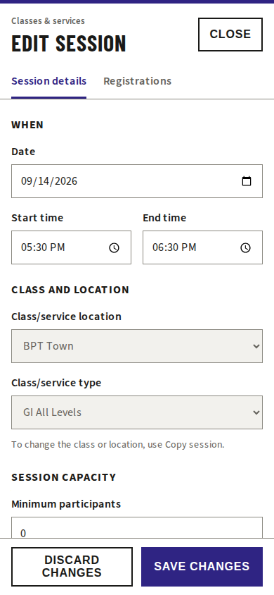
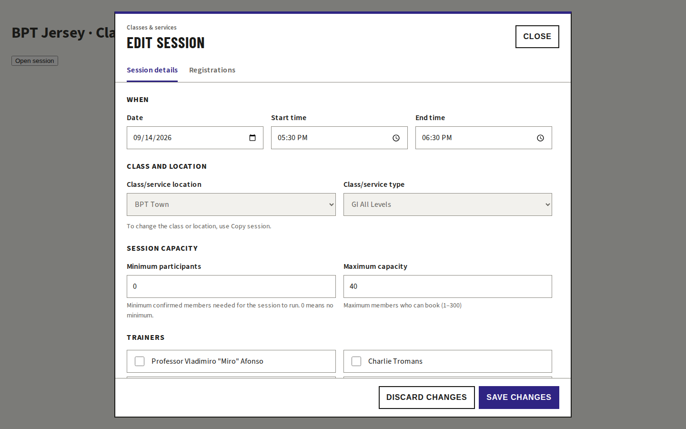

# Session editor responsive review

The create/edit session dialog now fills the mobile viewport and uses an explicit desktop width. Its header and primary actions stay visible while the fields scroll. Existing BPT colours, square borders, Barlow Condensed headings and Source Sans 3 body text are retained. No new application dependencies.

## Evidence

Measured using the real SessionPanel, production styles and locally built fonts in a browser fixture. API boundaries are mocked; no production records were changed.

| Check | Before | After |
| --- | --- | --- |
| Dialog at 390px viewport | 195px wide; content overflow | 390px wide; no horizontal overflow |
| Dialog at 1440px viewport | 720px wide; content overflow | 960px wide; no horizontal overflow |
| Input text | 12.48px | 16px |
| Registration reads on opening edit | 3 | 0; 3 after opening Registrations |
| Modal/focus handling | Non-modal `open` attribute | Native `showModal`, Escape and focus restoration |
| Save/close actions | End of scrolling content | Fixed footer |

Chromium checks passed at 320×568, 390×844, 768×1024, 1440×900 and 844×390. Checks include field containment, visible footer, keyboard navigation, read-only access, create/edit minimum and maximum capacity, and registration data retained across view switches.

## Validation

- Classes & Services test suite: 125 passing before the final loading and empty-date tests.
- Updated classes tests: 77 passing, including registration loading and deferred reads.
- Final SessionPanel tests: 25 passing, including the added empty-date error association.
- Web typecheck, ESLint, formatting and production build passed.
- Design review: PASS; closure copy, read-only copy guidance and missing-date feedback addressed.

WebKit browser installation found missing Linux runtime libraries. Safari/iOS device validation remains outstanding; Chromium emulation does not verify iOS keyboard or automatic zoom behaviour. Browser checks establish layout and request counts, not production latency or Core Web Vitals.
