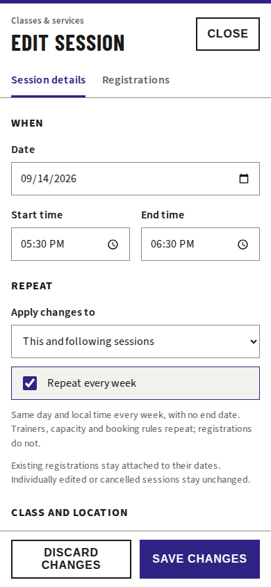

# Weekly session repetition

Sessions can repeat weekly without an end date. Enable **Repeat every week** when creating or editing a session. The location timezone preserves the local start/end time across daylight-saving changes. Trainers, capacity limits, class details and booking settings repeat; registrations do not.

For an existing series, editing defaults to **Only this session**. **This and following sessions** changes the selected occurrence and later regular occurrences. Individually edited or cancelled dates remain exceptions. Turning repetition off in this scope keeps the selected date and cancels later scheduled occurrences, including individual exceptions. The Cancel session action cancels only the selected date.

## Storage and deployment

Server-owned rules live in `academies/{academy}/sessionSeries`. Calendar reads materialise missing occurrences only within the requested window (maximum 90 days), with no lifetime generation horizon. Stable occurrence IDs preserve booking references. Transactions protect rule edits against concurrent calendar materialisation; existing occurrences are never overwritten by materialisation.

Changes to an existing series are atomic. An edit affecting more than 400 already materialised occurrences is rejected explicitly rather than partially applied. This is an edit transaction safeguard, not an end date for repetition.

Deploy the updated Firebase Functions before publishing the web interface. No dependency, Firestore rules or composite-index changes are required. Existing sessions remain one-off unless repetition is explicitly enabled. No production data was changed during verification.

## Verification

- Relevant web, schedule and domain suites: 493 tests passed; after the final callable additions, the focused backend suites passed 108 tests.
- Functions typecheck, web production build and ESLint on changed TypeScript files passed.
- Firestore emulator integration passed: atomic creation, concurrent reads and edits, stable IDs, preserved registrations, individual exceptions, stopping and academy isolation.
- Chromium using the real editor and production styles: repetition, scope selection and stopping passed at 320, 390 and 1440 px with no horizontal overflow. This does not constitute testing on physical Safari devices.

Emulator integration test: `qa/integration/weekly-session-repetition.test.ts`. It requires `FIRESTORE_EMULATOR_HOST` on localhost and uses only the demo project with synthetic, cleaned-up records.

